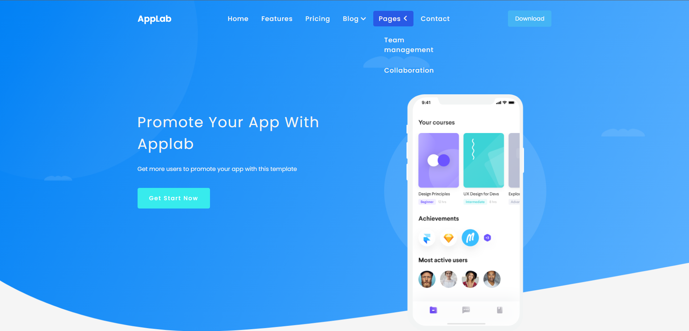

#  AppLab Website

See the live version of [AppLab](https://mateuszsuplewski.github.io/RWD-Website/).

AppLab Website is a responsive landing page builded with [Colarlib free template](https://colorlib.com/wp/template/applab/).

 


&nbsp;
 
## 🤔 Solutions provided in the project


- `BEM` - Methodology that provides us with special class naming convention. Adding a class to each tag on 			  the page translates into high reusability of the code, while simple class naming allows for quick understanding of the code.
	
- `Mobile First` - Approach in which web designers start product design for mobile devices first. We are more focused on mobile design and functionalities. Also, this solution provides us with no need to load additional CSS styles files for other devices, so resources to load are lighter for mobiles.
	
- `RWD` - Design technique that aims to display the website correctly on any device. It uses `media-queries` to manage used styles depending on the given resolution.

- `Font Awesome` - Internet's icon library and toolkit. Icons were used in this project for menu and socials.
	
- `Dropdown Menu` - Using quick and easy way to create clickable menu button that allows to drop menu.

- - Using checkbox to show menu **"on check"**.
```html
<nav class="nav">  
	<input type="checkbox" id="click" class="click">
	<label for="click" class="menu-btn">
		<i class="fas fa-bars hamburger"></i>
	</label>
	<ul class="nav__links">
		<li ><a>Home</a></li>
		<li ><a href="#">Features</a></li>
	</ul>
</nav>
```
- - Hide checkbox, now label which contains hamburger icon becomes menu toggler.
Styling menu with links to get **slide from left** effect.
	
```css
.nav__links {
	position: fixed;
	top: 60px;
	left: -100%;
	height: calc(100vh - 60px);
	width: 100%;
	display: block;
	transition: all 0.3s ease;
}
		
.click:checked~.nav__links {
	left: 0;
}

.click {
	display: none;
}
```
- `Flexbox & Grid`- grid.css contains responsive modifiers for flexbox that enable specifying different column sizes by using appropriate classes.

 &nbsp;


## 💭 Conclusions for future projects


In next projects I will definitely consider using css variables to store colors to makes things easier and clear to code/read. 
```css
:root {  
	--primaryText:  #4290f5;  
	--primary:  #4542f5;  
}

body { background-color:  var(--primary); }
```

Gradient also look like a cool feature to implement if you want to make stand outing Hero section or icons background.
```css
background: rgb(66,58,158);  
background: linear-gradient(30deg, rgba(66,58,158,1) 31%, rgba(0,212,255,1) 100%);
```

### Problems I struggled with:

Trying to make a website "*pixel perfect*" just to make it look like a template wasn't worth the effort. Website got too many unrelated margins and paddings just because of that decision. Next time I will code the project a bit different from the original one, but much cleaner. **That's the lesson for me**.

&nbsp;

## 🙋‍♂️ Feel free to contact me
In case you found any issues that could've been solved, you have ideas how we can create something more complex or just simply want to chat, then just let me know on: [Linkedin](https://www.linkedin.com/in/mateusz-suplewski-705017227/) or via Email : [Matx3582@gmail.com](mailto:Matx3582@gmail.com).


&nbsp;

## 👏 Credits
Thanks to my [Mentor - devmentor.pl](https://devmentor.pl/) & [Akademia Samouka](https://akademiasamouka.pl/) - for providing me with this task.

Also special thanks to [Colorlib](https://colorlib.com/) for free templates.